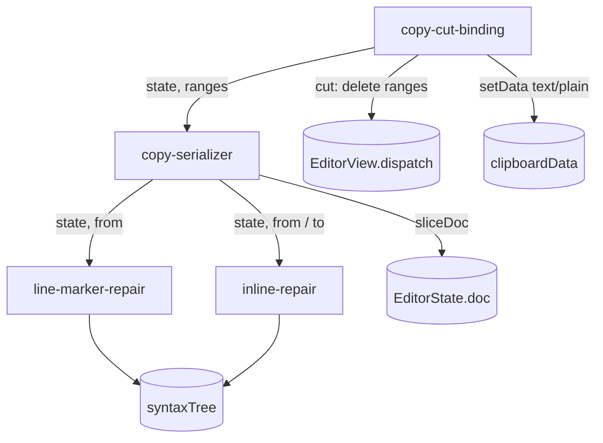

# Copy fidelity — architecture (FEAT-0045)

## Goal & non-goals

- **Goal:** copy/cut places well-formed markdown on the clipboard that reproduces
  the formatting *visible in the selection*, repairing the markers dropped at the
  selection's two boundaries.
- Repair **line markers** (heading `#`, blockquote `>`, list `*`/`-`) for a
  partially-selected first line, and **inline delimiters** (`**`/`__`, `*`/`_`,
  backtick runs) synthesized around a fragment at each boundary.
- The serialization core is **pure** (state + ranges → string); only the DOM
  copy/cut wiring touches the clipboard and dispatches the cut deletion.
- **Non-goals:** links/wikilinks (already revealed raw on selection — FEAT-0026),
  fenced code blocks, rich-text (`text/html`) clipboard, paste. The on-disk file is
  never read or written.

## Logical modules

- **inline-repair** — from the syntax tree, the inline delimiters missing at a
  boundary position: the opening delimiters to prepend at the selection start, and
  the closing delimiters to append at the selection end.
- **line-marker-repair** — the leading block-construct marker run of the first
  selected line, to prepend when the selection starts past it.
- **copy-serializer** — composes the two repairs over each selection range and
  joins them into the clipboard string. Pure.
- **copy-cut-binding** — the impure shell: a CodeMirror `copy`/`cut` DOM-event
  handler that runs the serializer, writes the clipboard, and (for cut) deletes the
  selected ranges. Falls through on an empty selection.

## Diagram

## Edge annotation table

| From | To | Payload (type) | Sync/Async | Failure owner | Retry policy |
|------|----|----|----|----|----|
| copy-cut-binding | copy-serializer | `(state: EditorState, ranges: readonly SelRange[])` | sync | n/a — serializer is total | none |
| copy-serializer | line-marker-repair | `(state, from: number)` → `string` | sync | total (returns "") | none |
| copy-serializer | inline-repair | `(state, pos: number, side)` → `string[]` | sync | total (returns []) | none |
| copy-serializer | EditorState.doc | `sliceString(from, to)` | sync | CodeMirror (in-range) | none |
| line-marker-repair / inline-repair | syntaxTree | parsed read | sync | CodeMirror | none |
| copy-cut-binding | clipboardData | `setData("text/plain", string)` | sync | browser; handler returns false if absent | none |
| copy-cut-binding | EditorView.dispatch | delete `ranges` (cut only) | sync | CodeMirror | none |

`SelRange = { from: number; to: number }` — the only payload type crossing a
boundary (a structural subset of CodeMirror's `SelectionRange`).

## State ownership

No new mutable state. The document and selection are owned by CodeMirror's
`EditorState`/`EditorView`; the serializer is a read-only function over a state
snapshot. Cut's deletion is a single transaction dispatched by the binding — the
only write, and it writes only the selected ranges (never the synthesized markers).

## Error model

Every serialization function is **total**: malformed or unparseable input yields
"no repair" (empty prefix/suffix), never a throw. The DOM handler returns `false`
(default browser behavior) when the selection is empty or `clipboardData` is
unavailable, so a failure degrades to plain CodeMirror copy rather than a broken
clipboard.

## Open questions

None load-bearing. Multi-range copy ordering follows CodeMirror's own convention
(ranges in document order, joined by `state.lineBreak`).

## Self-Review

- **Round 1 (cold read):** deferred to a subagent on the stubs in Phase 3 (this
  doc is small and its framing is dictated by the spec). Degraded-mode note: the
  author wrote the spec, so a truly cold read of *this* doc is done at the stub
  layer where it bites.
- **Round 2 (reconsider):** Considered folding `line-marker-repair` into
  `inline-repair` as one "boundary repair" module — rejected: they key off
  different tree shapes (line-leading block marks vs. ancestor inline spans) and
  apply to different positions (first line only vs. both boundaries). Keeping them
  separate makes each independently testable. Considered putting the DOM binding in
  `editor.ts` directly — rejected: the binding is small but is the one impure edge,
  worth naming so the pure core stays obviously pure. It will live in the same
  source file as the serializer (one new module file) but as a distinct exported
  extension.
- **Round 3 (simplify):** No premature generality — `SelRange` is the minimal
  payload; no options, no config, no caching (per-copy cost is trivial: one tree
  walk over a handful of ancestors). Multi-range support is not gold-plating: it is
  required to match CodeMirror's existing copy contract and is one `.map().join()`.
