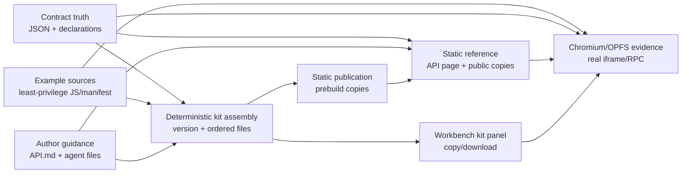

# M46 P4 — Authoring and validation architecture

## Goal and non-goals

- Publish one versioned Authoring Kit that teaches the complete M46 interaction
  surface to people and LLM agents.
- Keep declarations, machine contract, human guide, examples, workbench bundle,
  and static API hand-off derived from the same checked-in source files.
- Make least privilege and file fidelity observable in example manifests and
  command bodies.
- Validate the published surface through the real enabled-extension iframe/RPC
  path and OPFS without changing note bytes.
- Do not add runtime capabilities, extension events, or a new documentation
  service.

## Logical modules

- **Contract truth** — stores public v1 types, method metadata, permissions,
  limits, and lifecycle/error claims.
- **Deterministic kit assembly** — versions and enumerates the template,
  examples, declarations, contract, guides, and bundle download.
- **Author guidance** — explains safe authoring, least privilege, interaction
  outcomes, and Markdown-preserving write patterns.
- **Static publication** — copies the checked-in guide, contract, and
  declarations to their public URLs during the existing build step.
- **Static reference** — exposes the Markdown/JSON/declaration hand-off and
  renders method/type cards from the contract.
- **Browser evidence** — runs the published example shape through real
  Chromium/OPFS and checks the workbench/reference surfaces and file bytes.

## Diagram

## Edge annotations

| From | To | Payload | Sync/Async | Failure owner | Retry policy |
|---|---|---|---|---|---|
| Contract truth | Kit assembly | raw contract/declaration text + version | sync import | kit assembly tests | fail the build; no fallback copy |
| Example sources | Kit assembly | ordered manifest/source text | sync import | authoring-kit tests | fail the build; no implicit example |
| Author guidance | Kit assembly | ordered Markdown text | sync import | authoring-kit tests | fail the build; no fallback copy |
| Contract truth | Static reference | parsed contract JSON | sync page startup | contract parser/reference tests | show no partial reference; fail tests |
| Author guidance | Static reference | API.md/public static hand-off | sync build copy | build/docs tests | fail build; regenerate from kit |
| Kit assembly | Workbench kit panel | immutable file list/version | sync | workbench + kit tests | render all files or fail test |
| Kit assembly | Browser evidence | example manifest/source fixture | async browser load | Playwright test | retry only at Playwright test boundary |
| Contract truth | Browser evidence | contract content for static/reference identity only | async assertions | contract/docs tests; browser uses independent fixed expectations | fail with evidence; no product fallback |
| Example manifest | Browser evidence | exact permission array + command source shape | async OPFS seed/load | Playwright test with hard-coded least-privilege expectation | fail; never infer expected grants from the contract |
| Static reference | Browser evidence | static links and generated cards | async page navigation | Playwright test | fail; static URLs remain direct |
| Kit assembly | Static publication | API.md/JSON/declarations source text | sync build step | build + byte-identity tests | rerun build; no hand-edited public copy |
| Static publication | Static reference | public static URLs | sync page load | static hand-off tests | fail; direct static files remain the fallback |
| Workbench kit panel | Browser evidence | visible rows/download controls | async DOM interaction | Playwright test | fail; no hidden-only assertion |

## State ownership and consistency

- The `extension-kit/*` files own all published content. `src/authoring-kit.ts`
  owns only the ordered import list and kit version; it does not duplicate file
  contents.
- `extension-kit/api-contract.json` owns machine-readable API metadata;
  `src/extension-api-contract.ts` validates it and `api-docs-main.ts` renders
  it. The declaration and Markdown guide are checked against the contract by
  tests, not parsed into a second runtime model.
- `public/api.md`, `public/api-contract.json`, and
  `public/brulion-extension.d.ts` are generated publication copies from the
  extension-kit files during `prebuild`; they are never hand-edited. The
  publication edge is covered by byte-identity tests and `npm run build`.
- Browser test state is ephemeral OPFS. The test owns the seeded vault and
  records the active note's exact bytes before the command; no test result is
  allowed to depend on a write.
- The only mutable UI state is the existing workbench/API page DOM. Kit files,
  contract content, and examples are immutable inputs for a run. Browser
  assertions for least privilege and lifecycle outcomes are fixed from the
  FEAT-0106 acceptance criteria, not generated from the contract under test.

## Open questions

None load-bearing. Whether future kit releases add more examples is a later
content decision and does not change these boundaries.

## Self-Review

I checked whether the workbench, static page, and contract should be one
module. They have different failure owners (kit enumeration, page parsing, and
build publication), so merging them would hide drift rather than remove code.
I checked the browser edge for a direct file install path; none exists in the
product, so the test intentionally uses the example's published command shape
and separately verifies the kit rows instead of inventing an installation
feature. The diagram has no state edge that bypasses the checked-in kit source.
