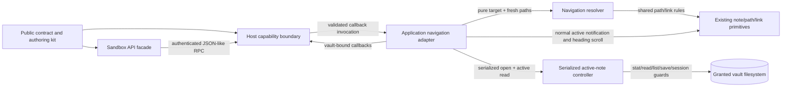

# M43 extension navigation — logical architecture

## Goal and non-goals

M43 lets an explicitly enabled local JavaScript extension inspect the active note,
open a canonical note path, and resolve a raw markdown or wikilink destination
through Brulion's existing rules. The extension boundary remains host-owned:
only bounded JSON-like values cross it.

- Navigation is additive to extension API v1 and independently permissioned.
- `openNote` is serialized with ordinary note-controller operations, revalidates
  the live filesystem, and uses the existing guarded flush before switching.
- `resolveLink` is read-only from the extension's point of view. It resolves
  against a fresh note-path listing but does not change the active view or files.
- A missing target is a result, not an implicit create; explicit
  `notes.create()` followed by navigation is the create-then-open flow.
- Browser validation uses the real opaque sandbox/RPC path and OPFS-backed notes.
- Out: events/triggers, browser history controls, external navigation, custom
  extension UI, and any new file mutation API.

## Logical modules

### Public contract and authoring kit
Owns the v1 public types, method/permission metadata, declarations, examples,
and drift checks. It describes the surface; it performs no navigation.

### Sandbox API facade
Owns `globalThis.brulion.navigation` inside the opaque extension runtime. It
turns public calls into authenticated RPC requests and turns JSON-like results
back into promises. It has no host references or vault knowledge.

### Host capability boundary
Owns RPC method registration, permission checks, argument/result validation, and
lifetime isolation for one runner. It receives narrow callbacks from the
application adapter and is the only bridge from extension code to those callbacks.

### Navigation resolver
Owns pure classification of a raw destination plus explicit `kind` and optional
source path. It adapts `splitAnchor`, `resolveNotePath`, `resolveWikilink`,
`isExternalLink`, and note-name validation to the public
`resolved`/`missing`/`external`/`invalid` result. It has no FSA or UI dependency.

### Serialized active-note controller
Owns the live folder binding, active path, editor buffer, mtime/dirty/conflict
state, authoritative note list, and operation queue. Its navigation operation
checks the target directly on disk, flushes through the stale-write guard, loads
the target, and emits the same active-note notification as a user switch.

### Application navigation adapter
Owns the callbacks injected into the host: the current active path, fresh note
listing for resolution, controller open calls, heading scrolling, vault
identity checks, and mapping controller outcomes to public anchor results. The
existing UI/router/session code remains the owner of route/history, sidebar, and
recency effects because it already consumes the controller's active-note
notification.

## Diagram

## Edge annotations

| From | To | Payload (type) | Sync/Async | Failure owner | Retry policy |
|---|---|---|---|---|---|
| Public contract and authoring kit | Sandbox API facade | `ActiveNote`, options, result unions, declaration metadata | synchronous shape; calls async | contract tests and sandbox facade | no automatic retry; malformed calls reject |
| Public contract and authoring kit | Host capability boundary | permission/method inventory and validators | synchronous | contract drift tests and host | no automatic retry; surfaces must stay in lockstep |
| Sandbox API facade | Host capability boundary | authenticated RPC `{method, params}` / JSON-like result | async request/response | RPC peer and extension promise | bounded timeout; extension chooses a retry |
| Application navigation adapter | Host capability boundary | vault-bound `getActiveNote`, `openNote`, `resolveLink` callbacks | synchronous injection; callbacks async | adapter's vault-generation guard | no automatic retry |
| Host capability boundary | Application navigation adapter | validated callback arguments and returned public values | async | host maps callback/validation failures to RPC errors | no automatic retry |
| Application navigation adapter | Navigation resolver | raw target, explicit `kind`, canonical source, fresh `Set<string>` paths | synchronous pure call after async listing read | adapter classifies listing/read failure as capability failure | no hidden retry; caller may resolve again |
| Application navigation adapter | Serialized active-note controller | canonical path and open request | async, serialized by controller | controller returns opened/already-open/missing/conflict | no automatic retry; caller handles result |
| Navigation resolver | Existing note/path/link primitives | strings, path set, split anchor | synchronous pure call | resolver returns `invalid` rather than throwing for target semantics | none |
| Serialized active-note controller | Existing note/path/link primitives | note paths/content and active-note/session notifications | sync callbacks around async operations | controller preserves pre-operation state or surfaces conflict | existing mtime/poll behavior; no new retry |
| Serialized active-note controller | Granted vault filesystem | canonical stat/read/list/write paths | async FSA operations | controller preserves bytes and returns conflict or rejects unexpected I/O | no hidden retry; filesystem remains authoritative |
| Application navigation adapter | Existing UI/router/session owners | active-note notification, route, recency, heading scroll | synchronous/local async | existing UI/session owners | existing route/session behavior; no navigation-specific retry |

## State ownership and consistency boundaries

- **Manifest permissions:** owned by the validated manifest and copied into one
  runner's immutable host permission set. A missing permission is a hard failure;
  existing manifests remain valid without the new permissions.
- **RPC lifecycle:** owned by the sandbox/host peers. Nonce, pending calls, and
  timeout state stay inside the peer; only JSON-like values cross it.
- **Active note, dirty buffer, mtime, conflict, operation queue:** owned by the
  serialized controller. One controller operation is the boundary for
  `stat/read → flush → revalidate → load → active notification`.
- **Authoritative note listing for `openNote`:** owned by the controller after a
  fresh filesystem check; navigation must not rely on the UI's paint snapshot.
- **Fresh note listing for `resolveLink`:** read by the application adapter from
  the currently bound vault only when the pure resolver needs existence/matching
  data, then passed to the resolver. External and syntax-invalid destinations
  short-circuit without a filesystem listing. The adapter's `currentNotes` paint
  snapshot is never used to decide resolution.
- **Route, sidebar, and recency:** owned by the existing application callback
  path, updated from the controller's normal active-note notification.
  `resolveLink` never reaches this state.
- **Anchor status:** transiently owned by the application adapter after the
  controller has loaded a successful target; the existing heading scanner
  supplies found/not-found. It is not persisted and never changes note bytes.
  The adapter serializes the controller result through anchor scrolling as one
  callback operation, so concurrent extension calls cannot report one note
  while scrolling another.
- **Vault binding:** owned by the attach lifecycle. Each injected callback closes
  over one directory handle and generation, and fails closed if that vault is no
  longer current.

## Settled decisions and deferred details

The M43 milestone notes and decision log settle API v1 additive compatibility,
the two navigation permissions, canonical `.md` paths, no implicit creation,
normal route/history behavior, and reuse of existing link resolvers. The exact
RPC validation constants, fixture helper names, and whether the controller's
internal open-result type is shared directly with the public contract do not
change the logical boundaries. Native picker and permission-prompt behavior is a
live review check, not an automated contract.

## Self-Review

### Round 1 — fresh-read findings integrated

A cold read exposed ambiguous callback direction, unclear ownership of note-path
snapshots, and names that hid whether a module was pure or filesystem-backed. The
architecture was regenerated: the application adapter now explicitly injects
callbacks into the host, the host invokes them, and the adapter obtains a fresh
listing before calling the pure resolver. The controller-to-filesystem edge is
now explicit in both the diagram and table. `anchorStatus` and vault-generation
guards are defined at their ownership points.

### Round 2 — reconsider and regenerate

A single `NavigationService` was reconsidered against separate resolver,
controller, host, and adapter boundaries. It would conflate pure link semantics
with serialized file mutation and make permission failures harder to isolate.
The regenerated split keeps those consistency boundaries visible. Route and
recency remain outside the controller because existing UI callbacks already own
those effects; moving them would create a second active-note announcement path.

### Round 3 — simplify

The authoring kit remains one contract module despite having JSON, declarations,
and prose. No resolver cache or second navigation queue is added: a fresh path
set is sufficient for one resolution, and the controller's existing queue is
already the mutation boundary. No retry or cross-window protocol is introduced.
