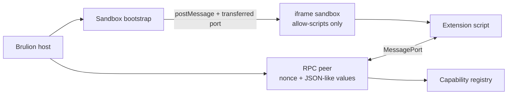

# FEAT-0081 — extension RPC spike: architecture

## Goal & non-goals

**Goal**

- Prove a small, authenticated, asynchronous message boundary between a sandboxed
  JavaScript peer and Brulion's host.
- Keep host-owned DOM, editor state, File System Access handles, and arbitrary
  object graphs out of extension code.
- Make timeout/disposal and malformed-message behavior explicit and testable.

**Non-goals**

- Script discovery, manifest/storage/UI, TypeScript compilation, or production
  command/editor/note integration.
- A claim that an iframe sandbox alone prevents denial of service or every form of
  network/navigation exfiltration.

## Logical modules

| Module | Responsibility |
|---|---|
| **sandbox bootstrap** | Creates the opaque-origin iframe, transfers one `MessagePort`, and checks the initial `Window` message source plus nonce. |
| **RPC peer** | Owns handshake state, request IDs, wire-value validation, capability dispatch, timeout, and disposal. |
| **capability registry** | Holds the explicitly approved method handlers; has no access to the iframe DOM or raw FSA handles. |
| **extension script** | Runs in the sandbox and uses only the RPC client; treated as untrusted code. |

## Diagram

## Edge annotation table

| From | To | Payload | Sync/Async | Failure owner | Retry |
|---|---|---|---|---|---|
| host | sandbox bootstrap | iframe window + nonce | sync setup | host | none; dispose and recreate |
| bootstrap | extension script | hello envelope + transferred `MessagePort` | async message | RPC peer (reject malformed/nonce) | one handshake attempt per peer |
| extension script | RPC peer | request envelope `{id, method, params}` | async message | RPC peer | caller may retry idempotent method only |
| RPC peer | capability registry | validated method + JSON-like params | async handler | capability registry returns structured error | no automatic retry |
| capability registry | RPC peer | JSON-like result/error | async message | RPC peer validates and settles call | none after timeout |
| RPC peer | extension script | response envelope | async message | caller rejects error/timeout | none |

## State ownership

- **Bootstrap nonce and expected iframe window** — host/bootstrap; one nonce per
  iframe instance and invalidated on dispose.
- **Handshake phase, pending requests, request IDs, timeout timers, listener** — one
  RPC peer; disposal is the consistency boundary and clears all of them.
- **Capability map** — host capability registry; registration returns a revoker and
  the map never contains raw app objects.
- **Wire values** — ephemeral envelopes only; recursive validation rejects class
  instances, cycles, handles, and other structured-clone-only objects.

## Self-Review

**Round 1 (fresh read):** The logical split is intentionally small. A reader could
mistake “sandbox bootstrap” for a second RPC implementation, so the contract keeps
bootstrap limited to iframe/source/nonce setup and assigns all envelope behavior to
the RPC peer. The table names a retry policy for every async edge; host recreation,
not hidden retry, handles dead peers.

**Round 2 (reconsider):** Considered separate `RpcHost` and `RpcClient` modules.
Rejected for the spike: both sides share the same envelope/state machine and a
single peer implementation is easier to test against a fake port. The production
phase may wrap the peer with host/client facades once capabilities settle.

**Round 3 (simplify):** Dropped planned adapters for `Window` and `MessagePort` from
the logical diagram. The peer only needs a minimal message-port shape; bootstrap is
the sole owner of `Window.postMessage` source checks. No event bus, schema library,
or retry queue is justified by this spike.
