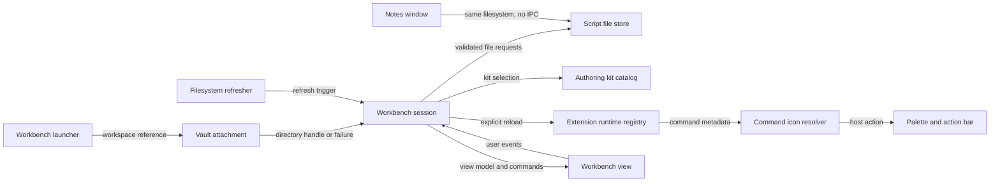

# M41 extension workbench architecture

## Goal and non-goals

- Open extension authoring in a separate Brulion window.
- Attach that window to the same user-granted vault through the persisted vault
  handle and effective workspace reference.
- Treat the filesystem as the source of truth for scripts, settings, mtimes, and
  diagnostics.
- Make a complete JavaScript/JSON extension tree editable with guarded writes.
- Keep explicit enablement and sandboxed runtime ownership in the existing host.
- Exclude FileSystemObserver, arbitrary assets/SVG, TypeScript, packages, network
  imports, IPC correctness, timers, and background execution.

## Logical modules

- **Workbench launcher** — opens a new workbench window with only the effective
  workspace reference and owns no extension data.
- **Vault attachment** — resolves the requested persisted vault, checks/request
  permissions, and returns one independent directory handle or an actionable
  failure.
- **Script file store** — validates script ids and file paths, discovers files,
  reads bytes/mtimes, and performs guarded create/save/rename/delete operations.
- **Workbench session** — owns the selected extension/file, path-keyed dirty
  text, refresh generation, reload request, and diagnostics for one window.
- **Workbench view** — renders the extension dropdown, file list, single editor,
  focused create/delete dialogs, status, file controls, kit actions, and
  permission errors; it delegates all data changes to the session. Enablement
  remains in the notes window's existing manager.
- **Authoring kit catalog** — exposes one versioned deterministic set of kit
  files to the repository and the workbench copy/download actions.
- **Extension runtime registry** — existing M39 vault-scoped registry; it loads
  only explicitly enabled extensions and receives reload requests after a
  successful source change.
- **Command icon resolver** — existing-host-only allowlist mapping from an
  extension string name to a bundled Lucide node, defaulting to puzzle.
- **Filesystem refresher** — session-owned focus/open/poll triggers that ask the
  store for current state; it does not interpret notifications as file content.

## Module diagram

## Edge contracts

| From | To | Payload (type) | Sync/Async | Failure owner | Retry policy |
| --- | --- | --- | --- | --- | --- |
| Workbench launcher | Vault attachment | effective workspace string or null | async | attachment reports to view | no automatic alternate-vault retry |
| Vault attachment | Workbench session | directory handle or typed attach failure | async | session renders actionable state | user reselects or retries on focus |
| Workbench session | Script file store | validated script id/path and expected mtime | async | store owns path/mtime validation; session owns display | refresh before user retry |
| Script file store | Workbench session | discovery/file records or guarded result | async | store owns path/mtime validation; session owns display | no blind retry after conflict |
| Workbench session | Authoring kit catalog | file id | sync | catalog returns bounded known data | none |
| Workbench session | Extension runtime registry | vault handle, settings, explicit reload | async | registry isolates runner failures | one explicit reload; no auto-enable |
| Workbench view | Workbench session | typed user intent (select, edit, save, create, delete) | sync callback / async result | view renders session diagnostic | user repeats after refresh |
| Filesystem refresher | Workbench session | open/focus/timer refresh event | sync trigger | session serializes refresh generations | next cadence after failed scan |
| Notes window | Script file store | shared vault filesystem state, no message payload | async independent access | each window owns its own read/guard | each window refreshes independently |
| Extension runtime registry | Command icon resolver | bounded optional icon name | sync | resolver defaults to puzzle | none |
| Command icon resolver | Palette and action bar | bundled Lucide IconNode | sync | host resolver rejects markup | default puzzle |

## State ownership and consistency boundaries

- The launcher owns only the child window reference and the effective workspace
  string. It never owns a handle, editor text, or runtime action.
- Vault attachment owns the one handle opened by this window. A denied handle
  produces no store and never selects another vault implicitly.
- The script store owns no cache. Every read obtains current bytes and mtime;
  every mutation validates the path and compares the supplied mtime before
  writing.
- The session owns the selected extension/file, path-keyed dirty text, refresh
  generation, diagnostics, and reload intents. Sidebar selection directly
  replaces the one editor while the draft map preserves unsaved text by extension
  and path. A generation token prevents stale reads from replacing a newer
  selection. Enablement is not duplicated in this view; confirmed deletion is.
- The view owns DOM and CodeMirror instances only. Programmatic loads are
  annotated and cannot mark a file dirty.
- The authoring kit catalog owns immutable versioned kit bytes. It is not
  user-vault state.
- The existing settings file owns explicit enabled extension ids. Discovery,
  editing, and kit copy never imply enablement.
- The runtime registry owns sandbox runners and actions. A failed runner is
  isolated; a successful file write may request a reload only for enabled ids.
- The refresh cadence is a notification only. The store rereads before it
  renders or writes, so missed or duplicate ticks cannot change correctness.

## Self-Review

### Round 1 — fresh-read flags

This review was performed in degraded mode because no cold-context subagent is
available in the current tool surface. The artifact was reread without relying
on the earlier discussion. The main risk found was an overly broad “workbench
session” name: it owns only one window's interaction state, while attachment
and storage own filesystem correctness. The edge table also needed an explicit
row for notes-window independence and refresh retry ownership; both are present
above.

### Round 2 — reconsideration

Two decompositions were considered: a generic workbench service with storage
inside it, and the narrower session/store split. The narrower split is retained
because mtime/path safety must be testable without DOM state and because the
separate window has no shared service. A separate “window bridge” module was
rejected: no IPC is part of the correctness contract. A dedicated kit catalog
is retained because exact bytes and versioning are independently testable.

### Round 3 — simplification

The design avoids a cache, observer abstraction, multi-editor model, and
transaction coordinator. The only cross-module state is the directory handle,
validated identifiers/paths, file records, and typed results. Refresh is a
single generation-aware operation rather than a second event bus.
