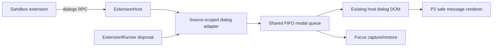

# Architecture and boundary table

| Boundary | Input | Output | Owner |
|---|---|---|---|
| sandbox → RPC | bounded message/options | JSON-like result or coded error | bootstrap/peer |
| host validator | strict records + permission | typed capability call | ExtensionHost |
| adapter → modal | request record + source | answer/disposed/timeout | dialog.ts |
| modal → adapter | user event | one settlement, cleanup | dialog.ts |
| runner → adapter | source disposal | source active/queued cancellation | lifecycle |
