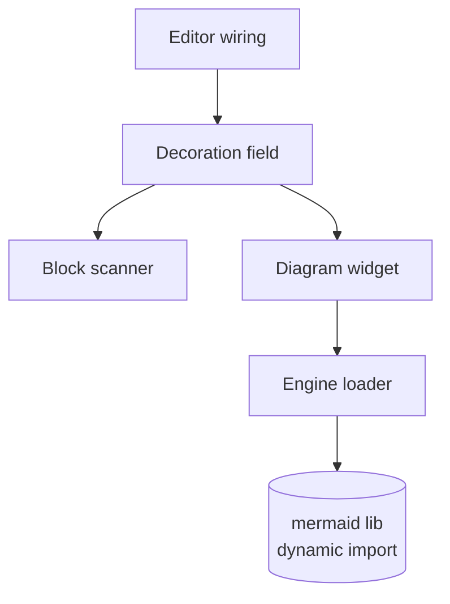

# M28 / FEAT-0056 — Mermaid diagram rendering — architecture

## Goal & non-goals

- **Goal:** render a closed ```` ```mermaid ```` fenced block as its diagram (SVG)
  in the editor, in place, without touching the file bytes.
- **Goal:** load the Mermaid engine lazily (separate chunk), only when a note
  actually contains a Mermaid block.
- **Goal:** reveal the raw source when the selection is inside the block; re-render
  on the way out. Show an in-place error for an invalid diagram.
- **Non-goal:** authoring aids (preview pane, snippets), theme-matching the diagram,
  embedding SVG into the file, non-`mermaid` diagram dialects.

## Logical modules

1. **Engine loader** — owns the lazy `import("mermaid")` + one-time `initialize`,
   behind a single cached promise. Exposes one async call that turns a diagram
   source string into a rendered SVG string (or throws on parse/render failure).
   Owns: the module-level load promise (see *State ownership* for its
   cache-on-success / clear-on-failure rule) and a monotonic counter used only to
   mint unique element ids for `mermaid.render`.
2. **Block scanner** — pure. Given the editor state, return the closed `mermaid`
   fenced blocks as `{ from, to, source }` (document offsets + the diagram text with
   the fences stripped). Knows nothing about decorations or rendering.
3. **Decoration field** — a CodeMirror `StateField<DecorationSet>`. Uses the scanner,
   drops any block overlapping the current selection (so its raw fenced source stays
   visible and editable — the *reveal-on-selection* behaviour), and for the rest
   emits a block `Decoration.replace` carrying a widget. Rebuilds on
   `docChanged || selectionSet`. Owns no persistent state (the set is derived).
4. **Diagram widget** — a `WidgetType` constructed with the block source. `toDOM`
   returns a container synchronously, then asks the engine loader to render and fills
   the container with the SVG (or an error box) when the promise settles. `eq(other)`
   compares the diagram source only: equal source means an identical diagram, so the
   existing rendered DOM is safe to reuse and the async render is skipped (the
   per-render id differs every call but is irrelevant to whether the *output* is the
   same). Owns: a per-instance "still mounted" flag to drop a stale async result
   after `destroy`.
5. **Editor wiring** — assembles the field + a base theme into one `Extension` and
   registers it in `editor.ts` after `markdownRendering`.

## Diagram



## Edge annotation table

| From | To | Payload (type) | Sync/Async | Failure owner | Retry policy |
|------|----|----|----|----|----|
| Editor wiring | Decoration field | — (extension registration) | sync | — | — |
| Decoration field | Block scanner | `EditorState` → `MermaidBlock[]` | sync | scanner returns `[]` on no match | none |
| Decoration field | Diagram widget | `source: string` (ctor) | sync | — | none |
| Diagram widget | Engine loader | `source: string` → `Promise<string>` (SVG) | async | widget (catches → error box) | none |
| Engine loader | mermaid lib | dynamic `import()` + `render(id, src)` | async | loader (rejects) → widget catches | load promise cached on success; cleared on failure so a later block can retry the import |

## State ownership

- **Engine loader:** one module-level `Promise<MermaidModule>` plus an integer
  counter. Caching rule (the single source of truth for the table's retry cell):
  the first call assigns the promise and triggers the import; concurrent callers
  `await` that same promise (sharing one in-flight import). On **success** the
  resolved promise stays cached forever (load-once). On **failure** the slot is
  cleared, so a later block's render attempts the import again — this is the *only*
  retry in the system, and it exists so a diagram seen for the first time while
  briefly offline can still render once the chunk is reachable. The counter only
  mints unique `mermaid.render` element ids; it is not state anyone reads.
- **Diagram widget:** a per-instance `mounted` boolean, set false in `destroy()`, so a
  late-resolving render for a removed widget is discarded (no write to detached DOM).
- **Decoration field:** the `DecorationSet`, derived purely from `(doc, selection)`.
  No mutable state of its own.

## Phase 5 refinement — click-to-reveal handler

Implementation surfaced one addition the diagram didn't anticipate: a block-replace
widget is **atomic**, so a plain click lands the caret on a block boundary, which the
*strict* selection-overlap rule (chosen so a note opening on a diagram still renders,
not reveals) deliberately does NOT treat as "inside". To keep click-to-edit working,
the **Decoration field** module also installs a small `mousedown` handler
(`EditorView.domEventHandlers`): a click on a rendered diagram moves the caret just
inside that block, so the next rebuild reveals the raw source. Public surface is
unchanged (`mermaidRendering: Extension` now bundles the field + this handler).

## Resolved details (not load-bearing for signatures)

- **Unique render ids:** a module-level incrementing counter, not `Date.now`/
  `Math.random` (and the latter are workflow-script-banned anyway). Enough for
  uniqueness within a session.
- **Mermaid `initialize` options:** `startOnLoad: false` (we render manually);
  `securityLevel` left at the default `strict` (sanitizes; fine for local notes).

## Self-Review

- **Round 1 (cold subagent):** flagged the "source" name collision (render-id
  "source" vs diagram "source"), a retry contradiction between the edge table and
  state-ownership, an undefended "eq on source" claim, "reveal-raw" used before
  defined, and a stale "Open questions" heading over resolved decisions.
- **Round 2 (reconsider/regenerate):** renamed the render-id "source" to a plain
  *counter* (the word "source" now only ever means diagram text); reconciled the
  retry behaviour into one rule (cache-on-success / clear-on-failure) stated once in
  *State ownership* and referenced from the table; spelled out why `eq` on source
  alone is sufficient (equal source ⇒ identical output ⇒ DOM reuse safe; per-render
  id is irrelevant to output equality); defined the reveal-on-selection behaviour
  where it's first used; relabelled "Open questions" → "Resolved details". Module
  decomposition reconsidered and **kept** — scanner (pure) / field / widget / loader
  / wiring each hold one responsibility with no pass-through layer; an alternative
  that folded the scanner into the field was rejected because the pure scanner is the
  unit-test seam.
- **Round 3 (simplify):** no module wraps a single call; the loader genuinely adds
  the load-once + id concerns, the widget genuinely adds async + cancellation. The
  counter and `mounted` flag are the minimum state. Nothing to subtract. One
  robustness point kept rather than deferred: the clear-on-failure retry, because
  without it a first-ever diagram viewed offline would be permanently stuck even
  after reconnecting.
