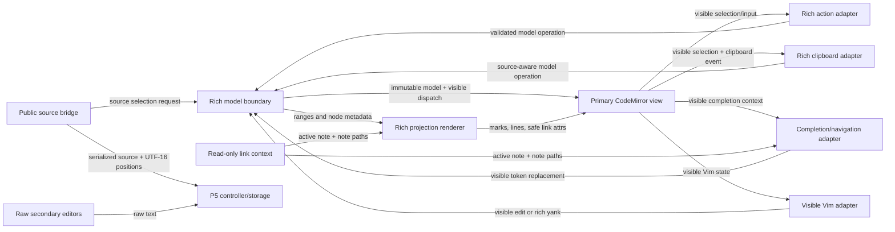

# M47 P6 — rich editor adapter architecture

## Goal and non-goals

- Make the primary CodeMirror projection usable through formatting, completion,
  clipboard, paste, heading navigation, Vim, and extension selection.
- Preserve Markdown as the source/storage format and keep all source coordinates
  in JavaScript UTF-16 units at the public boundary.
- Make one user action one model/visible CodeMirror history transaction.
- Keep raw workbench, script, and conflict-diff editors unchanged.
- Exclude HTML clipboard interoperability, metadata interpretation, and the
  legacy-renderer cleanup reserved for M47 P7.

## Terms and contracts

- **Source** is the serialized Markdown held by the P5 `RichDocument`.
- **Visible text** is `RichDocument.visible`, normalized to CodeMirror's LF
  separator at the view edge. Its positions are the only positions ordinary
  rich actions and Vim may use.
- **Source positions** are UTF-16 offsets into serialized Markdown. Only the
  public extension/storage facade and explicit P4 source-edit operations use
  them.
- **Model dispatch** means: derive an immutable next `RichDocument`, calculate
  its visible projection and selection, then dispatch the model state effect and
  visible CodeMirror change together. If derivation returns `null` or throws a
  bounded range error, no dispatch occurs.
- **Copy synthesis** is an ephemeral clipboard result. It may add boundary
  Markdown around the selected visible text, but it never changes the model or
  disk source.

## Logical modules

1. **Rich model boundary** — owns the `RichDocument` state field, visible/source
   mapping, source-preserving command operations, and atomic model dispatch.
2. **Rich projection renderer** — paints marks, block classes, and link metadata
   from the current immutable model; it never hides/replaces source text.
3. **Rich action adapter** — maps visible selections to inline/block model actions
   for toolbar, keyboard, slash, and context actions.
4. **Rich clipboard adapter** — serializes visible selections to Markdown and
   applies text-only paste/cut through the model boundary.
5. **Completion/navigation adapter** — supplies slash/wikilink completions and
   maps serialized heading-anchor requests into visible selections.
6. **Visible Vim adapter** — lets Vim operate on visible positions and shares the
   rich clipboard serializer for yank.
7. **Public source bridge** — exposes the current serialized source and source
   UTF-16 selection contract to storage/extensions, translating at the edge.
8. **Raw editor clients** — secondary editors with direct CodeMirror documents.

## Diagram

## Edge annotations

| From | To | Payload | Sync/Async | Failure owner | Retry policy |
|---|---|---|---|---|---|
| Rich model boundary | Primary CodeMirror view | `RichDocument`, visible diff, visible selection | sync | Model boundary rejects the candidate before dispatch | Retain prior state; no automatic retry |
| Rich model boundary | Rich projection renderer | immutable ranges, blocks, links, source metadata | sync | Renderer ignores invalid decoration range; model remains authoritative | Rebuild on next state update |
| Rich projection renderer | Primary CodeMirror view | mark/line decorations and fixed `data-*` attributes derived from model metadata | sync | Renderer owns DOM decoration failure; it cannot mutate source | Rebuild on next view update |
| Primary CodeMirror view | Rich action adapter | visible `EditorState`, selection, action id | sync | Adapter returns no-op for invalid/unsupported selection | User chooses another selection |
| Rich action adapter | Rich model boundary | visible range plus requested model operation | sync | Model boundary rejects opaque/cross-fragment unsafe operation | No partial retry |
| Primary CodeMirror view | Rich clipboard adapter | visible ranges and `text/plain` event data | sync | Adapter falls through when clipboard/ranges are unavailable | Browser/CodeMirror fallback may handle it |
| Rich clipboard adapter | Rich model boundary | ephemeral Markdown payload or visible replacement candidate | sync | Model boundary rejects unsafe cut/paste | No partial retry |
| Primary CodeMirror view | Completion/navigation adapter | visible completion context or anchor request | sync | Adapter returns `null`/false for malformed token/missing anchor | Completion re-queries; anchor is a no-op |
| Completion/navigation adapter | Rich model boundary | visible token replacement or mapped selection | sync | Model boundary validates and atomically dispatches | User may retry from current state |
| Read-only link context | Completion/navigation adapter | active note and note-path set | sync | Completion treats stale context as a fresh query | Re-query the facet |
| Read-only link context | Rich projection renderer | active note and note-path set | sync | Renderer marks link validity only | Repaint on context change |
| Primary CodeMirror view | Visible Vim adapter | visible motion/edit/selection state | sync | Vim owns mode mechanics; model owns edit validity | Continue from retained Vim state |
| Visible Vim adapter | Rich model boundary | visible edit or rich yank serialization request | sync | Model rejects unsafe edit; serializer returns payload without mutation | No mutation retry |
| Public source bridge | P5 controller/storage | serialized Markdown and source UTF-16 selection | sync facade / async controller | Facade validates coordinates; controller/storage owns I/O | Caller re-reads after rejection |
| Public source bridge | Rich model boundary | source-to-visible selection or visible replacement | sync | Model retains state on stale/invalid request | Caller re-reads current source/model |
| Raw secondary editors | P5 controller/storage | direct raw text | sync facade / async controller | Existing raw client owns its errors | Unchanged |

## State ownership and transaction boundaries

- The P5 rich state field is the sole owner of the current `RichDocument` for
  the primary view. The pure Markdown model is immutable and stateless.
- CodeMirror owns visible text and the visible selection. Model effect, visible
  diff, and selection are committed by one dispatch for one user action; undo
  inverts that same model effect.
- The renderer owns only ephemeral decorations. It resolves link appearance
  from the read-only link context and model link node; it does not parse a second
  Markdown grammar or cache source.
- The clipboard adapter owns no clipboard cache. Copy is read-only; cut/paste
  submit one candidate to the model boundary.
- CodeMirror owns completion popup state. Completion sources only calculate
  candidates and visible replacement ranges.
- Vim owns its mode/register state. Rich edits still enter through the model
  boundary, and the hidden-source caret guard is omitted in rich mode.
- The public source bridge owns no source cache. It reads the current model for
  every extension/storage request and translates positions only at the edge.
- The P5 controller remains the owner of saved serialized source, dirty/conflict
  state, and mtime; P6 adapters never clear those states directly.

## Representative traces

### Visible formatting

A toolbar/keyboard/slash action reads the visible selection, derives a
source-preserving model operation, and passes the resulting `RichDocument` plus
visible selection to the model dispatcher. The dispatcher commits one state
effect and one visible projection change. The controller later observes one
serialized-source change through its existing callback.

### Partial rich copy

A copy event converts CodeMirror LF selection offsets to model-visible offsets.
The source-map serializer finds active mark, block-prefix, and link boundaries,
reads original delimiters where unambiguous, and writes only `text/plain`.
No model, selection, dirty flag, or disk state changes.

### Extension reverse selection

An extension reads the public selection. The source bridge maps both visible
endpoints to serialized UTF-16 offsets and keeps `anchor`/`head` direction; the
text is sliced from the serialized source. A set request maps both source
endpoints back to visible positions and dispatches only a selection transaction.

## Open questions deliberately deferred

- P7 decides which legacy raw-renderer code can be deleted after browser
  validation; this architecture does not load it in rich mode.
- A future source-mode UI may expose P4 special/link source edits. P6 keeps those
  operations explicit in the model API rather than creating another document.

## Self-Review

### Re-read and reconsider

The fresh read flagged that the earlier draft blurred model ownership, source
ownership, and ephemeral clipboard synthesis. This version defines those terms
up front and states the concrete one-dispatch mechanism instead of presenting
byte fidelity as an unsupported promise. It also explains why a copied wrapper
can be synthesized without violating the file-fidelity rule: copy never mutates
source.

The earlier “public bridge → storage” wording could imply that the bridge owns
serialized text. It now says the P5 controller/storage consumes the bridge's
current model read; the bridge caches nothing. “Safe link attributes” now means
fixed attributes derived from trusted model metadata, not arbitrary user HTML.

### Simplification

The completion and navigation adapters remain one logical module because both
translate user-facing context into visible positions and share link context;
splitting them would add no state or acceptance boundary. There is no clipboard
cache, renderer-side parser, command registry, or rich selection sidecar.

### Performance

Rendering iterates current model ranges, copy walks selected ranges, and
completion uses the existing in-memory note-path facet. No adapter performs
filesystem I/O or whole-vault work in a keystroke path.
