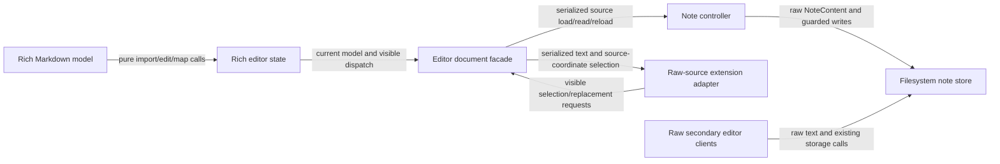

# M47 P5 — rich editor integration architecture

## Goal and non-goals

- Make the primary CodeMirror note editor show the loss-aware rich projection
  while storage receives serialized Markdown.
- Keep untouched Markdown bytes, opaque syntax, line endings, and mtime guards
  intact through ordinary editing and refresh.
- Give autosave, switching, mutation, refresh, conflict, and raw-source API code
  one serialized-source boundary.
- Keep workbench, script, and diff editors raw and independent.
- Do not implement P6 selection/clipboard/command/Vim behavior or P7 browser
  migration cleanup here.

## Logical modules

| Module | Responsibility |
|---|---|
| **Rich Markdown model** | Pure import, visible projection, UTF-16 source/visible mapping, and loss-aware source/visible edits. Existing P1–P4 contract. |
| **Rich editor state** | The sole mutable owner of the primary view's `RichDocument`; a CodeMirror state field and transaction filter keep visible text and the model in one transaction/history unit. |
| **Editor document facade** | A typed source boundary over one `EditorView`: reads serialized Markdown, loads/reloads source, and translates source-coordinate selection at the primary boundary. It delegates rich state queries to **Rich editor state** and uses direct `state.doc` only for raw views. |
| **Note controller** | Owns the active note's saved serialized snapshot, dirty/conflict state, mtime, cache, and serialized note lifecycle. It never treats visible editor text as Markdown. |
| **Filesystem note store** | Reads/writes/lists/stats/moves plain `.md` files and is the final stale-write authority. Existing module; it receives only source strings. |
| **Raw-source extension adapter** | Exposes serialized Markdown and UTF-16 source selections to local extensions, translating source positions into visible editor positions only at the primary facade. |
| **Raw secondary editor clients** | Workbench, script, and conflict/diff surfaces that retain their existing raw CodeMirror documents and do not instantiate rich state. |

## Diagram

## Edge annotations

| From | To | Payload (type) | Sync/Async | Failure owner | Retry policy |
|---|---|---|---|---|---|
| Rich Markdown model | Rich editor state | `RichDocument`, visible edit ranges, `RangeError`/`null` | sync | Rich editor state rejects the candidate and keeps its previous field value | No retry; the originating CodeMirror transaction is rejected or left unchanged |
| Rich editor state | Editor document facade | state-field `RichDocument`, serialized source, visible/source positions | sync | Facade reports a bounded-position error to its caller | No retry for an invalid position |
| Editor document facade | Note controller | `readMarkdown(): string`, `loadMarkdown(source)`, `reloadMarkdown(source)` | sync dispatch inside async controller operations | Controller keeps its prior dirty/conflict state if a load/reload fails | No automatic model retry; controller may use its existing fallback-note retry after a successful disk mutation |
| Note controller | Filesystem note store | `readNote`, `saveNote`, `statNote`, `NoteContent`, known mtime | async | Store reports I/O errors and `conflict`; controller classifies/announces them | Existing serialized queue/debounce; never retries a stale write as last-writer-wins |
| Editor document facade | Raw-source extension adapter | serialized `string`, `ExtensionSelection` with source UTF-16 offsets | sync facade / async RPC | Adapter rejects out-of-bounds or unrepresentable source selection | No retry; extension must re-read source/model |
| Raw-source extension adapter | Editor document facade | source selection/replacement request translated to visible positions | sync | Facade rejects hidden/cross-node unsafe request without mutation | No retry; stale source operation is re-read and retried by the extension if desired |
| Raw secondary editor clients | Filesystem note store | existing raw text and note-storage calls | async | Each existing client owns its own error/UI behavior | Unchanged; no primary rich state is involved |

## Invariants across the edges

1. The **Rich editor state** field is the sole mutable model owner. The facade
   never caches a second `RichDocument`; every read queries the field in the
   current `EditorState`.
2. A primary source load/reload changes the model field and visible CodeMirror
   document in one programmatic transaction. The controller may clear dirty or
   adopt a new mtime only after that transaction succeeds.
3. A user edit is one transaction. The filter computes a candidate model from
   the pre-transaction visible document, then commits the model effect and the
   final visible projection together. A failed candidate cannot leave a raw
   interim projection behind.
4. External refresh is allowed to replace the model only when the controller's
   live `dirty`, `conflict`, and `savePromise` checks all say it is safe. A dirty
   or conflicted buffer raises/retains conflict instead.
5. Persistence, cache, conflict versions, link maintenance, and extension text
   consume serialized source. Visible text is never passed to `saveNote`.
6. The filesystem mtime check remains the final write authority even when the
   controller's serialized dirty snapshot says a write is needed.
7. Opaque/special source is changed only by an explicit source-island route; no
   rendered widget, visible placeholder, or unknown syntax is serialized.

## State ownership and consistency boundaries

- **Rich model:** the `Rich editor state` owns the current `RichDocument` in a
  state field. The pure model owns no mutable state.
- **Visible CodeMirror document:** CodeMirror owns the current projection text;
  the state-field effect and visible document are committed together. Neither
  visible text nor the facade's return value is a separate cache.
- **Serialized source:** the state field's model is authoritative for the
  current source. The facade reads it synchronously. The `Note controller` owns
  `savedMarkdown`, the last successful disk source, and `dirty` as the inequality
  between current serialized source and `savedMarkdown`.
- **Conflict:** the `Note controller` owns the standing conflict flag and
  serialized `{ mine, theirs }`; the existing editor lock is a UI projection of
  that state. The facade never clears conflict.
- **Filesystem mtime:** the note store observes current mtime during a guarded
  write; the controller owns the last-seen mtime associated with its source
  snapshot.
- **Secondary editors:** each raw client owns its own CodeMirror document and
  is not included in the primary source/model consistency boundary.

## Representative traces

### Load and autosave

`readNote` returns raw `NoteContent` → controller calls `loadMarkdown(source)` →
state imports/project source and commits a programmatic transaction → controller
records `savedMarkdown = source` and `dirty = false` → later `readMarkdown()` is
passed unchanged to `saveNote` with the known mtime.

### Typed conversion

A visible transaction containing `**hello** ` enters the state filter → the pure
model applies the visible edit and recognizes the explicit boundary → the filter
commits `hello ` plus the model effect in the same history transaction → the
controller's change callback reads serialized `**hello** ` and compares it with
`savedMarkdown`.

### External refresh

The poller detects a changed mtime → controller confirms the live buffer is clean
and reads new raw Markdown → facade maps selection/viewport through the old
source diff and new model, then commits a programmatic reload → controller adopts
new serialized source and mtime without firing autosave.

### Conflict

Current serialized source differs from `savedMarkdown` → disk mtime changes →
controller captures serialized `mine`, reads current disk `theirs`, and raises
the existing modal → only a guarded keep/take operation can clear the conflict;
failed resolution leaves both the model and conflict standing.

## Open questions

None are load-bearing for P5. P6 decides how rich visible selections interact
with clipboard, command adapters, and Vim; P7 decides final legacy-renderer
removal and browser migration coverage.

## Self-Review

- **Fresh-read findings and actions:** The first cold read flagged ambiguous model
  ownership, a backwards facade/controller edge, an unsafe refresh trace, and
  vague error/retry cells. This rewrite makes the CodeMirror state field the sole
  mutable owner, reverses the facade/controller direction, states the live clean
  precondition for refresh, and names each failure owner/retry policy.
- **Reconsideration:** A facade-owned model cache was rejected because it would
  duplicate the state field and permit source/model skew. A controller-owned
  model was rejected because it would not participate atomically in CodeMirror
  transactions. Raw secondary editors remain outside the facade by explicit
  mode, not by an accidental bypass of a claimed universal boundary.
- **Simplification:** The facade is a thin query/dispatch adapter; it adds no
  source cache, sidecar, filesystem operation, or extra serialization format.
  The pure model remains the only parser and source-edit implementation.
- **Performance:** Editor transactions perform no I/O. Refresh imports one new
  source and computes one minimal visible change; storage concurrency remains
  exactly the controller's existing queue/debounce and note-store guard.
