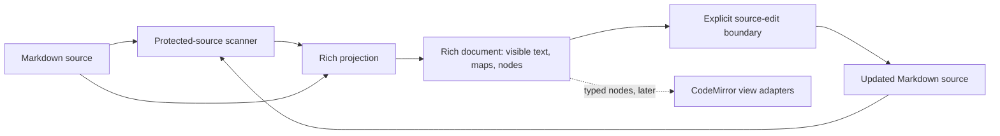

# M47 P4 — rich special-node architecture

## Goal and non-goals

- Recognize complete links and wikilinks as visible-label rich nodes.
- Keep fences, tables, frontmatter, and Mermaid as exact, typed opaque source
  islands with explicit source-edit access.
- Preserve existing P1–P3 range and pending-state contracts.
- Keep all offsets in JavaScript UTF-16 units and keep untouched source bytes.
- Do not resolve links, render widgets, persist documents, or wire the controller.

## Logical modules

1. **Protected-source scanner** — scans Markdown source into complete link nodes,
   protected special blocks, and exact table row/cell spans. It never mutates or
   serializes source.
2. **Rich projection** — combines scanner output with the existing heading,
   block, and inline-mark projection. It emits visible fragments, hidden link
   syntax ranges, typed node metadata, and deterministic source/visible maps.
3. **Explicit source-edit boundary** — validates a node/range request, applies
   exactly one source replacement, and reimports through the scanner/projection.
   It owns rejection of stale, cross-node, and non-lossless edits.
4. **Existing view adapters** — later consumers of typed nodes; deliberately not
   part of this phase's state or parsing authority.

## Diagram

## Edge annotations

| From | To | Payload | Sync/Async | Failure owner | Retry policy |
|---|---|---|---|---|---|
| Markdown source | Protected-source scanner | UTF-16 string | Sync | Scanner returns no typed match and leaves the span raw | None; deterministic rescan |
| Protected-source scanner | Rich projection | Link/special/table metadata with exact source ranges | Sync | Projection validates non-overlap and falls back to opaque line | Rescan after source edit |
| Markdown source | Rich projection | Existing source plus P1–P3 parser state | Sync | Projection owns malformed/unsupported fallback | None; deterministic import |
| Rich projection | Rich document | Visible fragments, ranges, node arrays, pending state | Sync | Projection guarantees mapping invariants or throws only on internal invariant violation | None |
| Rich document | Explicit source-edit boundary | Explicit node/range request and replacement text | Sync | Edit boundary rejects stale/ambiguous/cross-node requests with `null` | Caller may retry after fresh import |
| Explicit source-edit boundary | Markdown source | One validated source replacement | Sync | Edit boundary never partially applies; invalid request leaves document unchanged | Caller must submit a new request |
| Rich document | Existing view adapters | Read-only typed node metadata | Sync | Later adapter owns rendering failure; source model is unaffected | View may redraw from same document |

## State ownership and consistency

- The immutable `RichDocument` owns the current source snapshot, visible
  projection, source/visible ranges, link nodes, special nodes, replacement
  history, and existing pending/explicit input state.
- The scanner owns no mutable state. Its offsets are derived from the source on
  every import; it is not a cache or a second source of truth.
- The edit boundary owns no long-lived state. A request is valid only against
  the supplied document's exact source and node ranges; the result is a fresh
  document from the updated source.
- A source edit is one consistency boundary: either the replacement is rejected
  or the entire source is reprojected. No intermediate document or widget output
  is observable.
- Rendering, link resolution, async Mermaid work, and persistence own state only
  outside this phase and must consume serialized source/node metadata rather than
  writing back derived output.

## Open questions deliberately deferred

- Whether P5's CodeMirror adapter shows a special island as raw text, a widget,
  or a source-mode affordance is a view decision; this pure model keeps raw bytes
  visible and map-safe.
- Whether future Markdown destination syntax should support titles, angle-bracket
  destinations, or reference links; ambiguous forms remain opaque now.

## Self-Review

### Re-read and reconsider

The first framing risked making each special block its own stateful subsystem.
Re-reading the P0 matrix and the P1–P3 contract favors one scanner plus one edit
boundary: all special constructs share the same exact-span/opaque/source-edit
invariant, while links are the only construct that contributes visible rich
fragments. A separate renderer/parser authority was rejected because it would
reintroduce duplicate recognition and source drift.

The word “node” is metadata, not a mutable tree. This keeps the model compatible
with the existing flat `ranges` array and avoids inventing a ProseMirror-like
schema that the spec does not require.

### Simplification

No async boundary, cache, resolver, or serialization service is justified in P4.
Table alignment and Mermaid language are advisory metadata; raw source remains
the only serialized representation. Invalid edits return `null` rather than
introducing a new error hierarchy for ordinary editor input.
