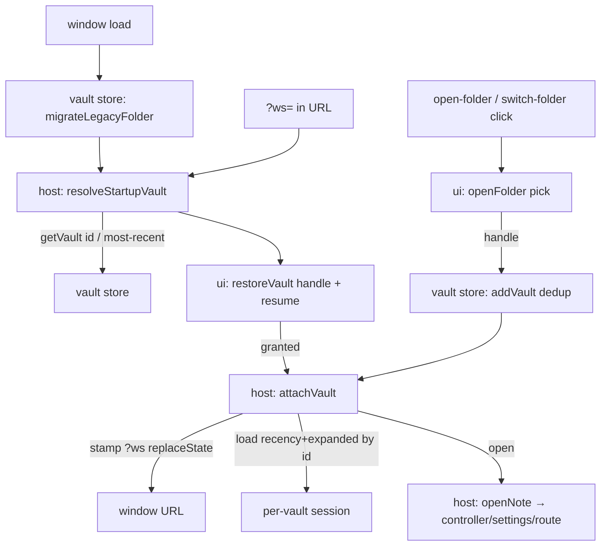

# FEAT-0059 — Vault model & per-window identity: architecture

## Goal & non-goals

**Goal**
- Persist a **set** of granted folders ("vaults"), each `{ id, handle, name }`, instead
  of one origin-global handle.
- Give each window a stable vault identity in its URL (`?ws=<id>`), so reload
  re-attaches to the same vault and two windows stay independent.
- Recency + expanded-folders become **per-vault**; migrate a pre-M33 single handle
  (and its global recency/expanded) transparently.

**Non-goals**
- The workspace switcher UI (palette action + chooser, forget-a-workspace) — P2.
- Per-vault sidebar width/collapse and active-note — stay global.

## Modules (logical)

| Module | Responsibility |
|--------|----------------|
| **vault store** | The persisted set of `{id,handle,name}` over IndexedDB: list, add (dedup by `isSameEntry`, mint opaque id, most-recent-first), get-by-id, remove, and one-time migration of the legacy single handle. Owns vault identity + the set. No DOM, no URL. |
| **per-vault session** | Recency + expanded-folders keyed by vault id; a migration copying the old global values onto a vault. (Extends the existing session module; sidebar width/collapse + active-note stay global there.) |
| **attach/restore flow** | The window-identity orchestration (lives in the host, `main.ts`): read/stamp `?ws`, hold the current vault id, resolve which vault to open on load (`?ws` → store → fallback), and attach a vault (stamp URL, load its per-vault session, open it). |
| **folder access primitives** | Pick a folder; query/request permission with the resume-button affordance — parameterized on a given vault handle. (Extends the existing `ui` module; the old single-handle `restoreFolder` is replaced by `restoreVault`.) |

## Diagram

## Edge annotation table

| From | To | Payload (type) | Sync/Async | Failure owner | Retry |
|------|----|----|----|----|----|
| load | vault store `migrateLegacyFolder` | — | async | vault store (no-op if already migrated / nothing to migrate) | none |
| host `resolveStartupVault` | vault store | `?ws` id → `getVault(id): Vault \| undefined`; else `listVaults()[0]` | async | host (undefined → welcome screen) | none |
| host | ui `restoreVault` | `vault: Vault`, resumeButton, `onAttach: (v)=>Promise` | async | ui (declined permission → keep resume button) | user-gesture retry |
| pick click | ui `openFolder` | `onOpen: (handle)=>Promise` | async | ui (dismissed picker → no-op; errors logged) | none |
| ui `openFolder` | vault store `addVault` | `handle` → `Vault` (existing if `isSameEntry`) | async | vault store | none |
| host `attachVault` | window URL | `stampWorkspace(id)` → `history.replaceState` (preserve hash) | sync | host | none |
| host `attachVault` | per-vault session | `loadRecency(id)` / `loadExpandedFolders(id)` | async | session (empty defaults) | none |
| host `attachVault` | host `openNote` | `vault.handle` | async | existing openNote flow (FEAT-0031) | existing |

## State ownership

- **Vault set** — owned by the vault store (one idb-keyval key `brulion:vaults`, a
  `Vault[]` most-recent-first). The single writer of vault identity.
- **Current vault id** — owned by the host (`main.ts`), set in `attachVault`; the key
  for per-vault session reads/writes and the value stamped to `?ws`.
- **Per-vault recency / expanded-folders** — owned by the session module, keyed by
  vault id; loaded into the host's in-memory `recency`/`expandedFolders` on each
  attach (replacing the old eager module-init load).
- **Global session** (sidebar width/collapse, active-note) — unchanged owners/keys.
- **URL** — the window's `?ws` (vault) + `#/path` (note); the per-window state, owned
  by the host's route sync (extends FEAT-0036).

## Open questions

- None load-bearing — all forks settled in the M33 live discussion (DECISIONS.md):
  opaque id; per-vault recency+expanded only; "workspace" in UI; `isSameEntry` dedup;
  legacy migration.

## Self-Review

**Round 1 (fresh re-read, cold subagent).** Deferred to the stub phase's cold read —
the doc is short and the boundaries map 1:1 to the settled plan; the higher-value cold
read is on the signatures (Phase 3).

**Round 2 (reconsider).** Considered folding "per-vault session" into the vault store
(one module owning everything vault-keyed). Rejected: the session module already owns
recency/expanded (FEAT-0039/0043) and the global keys; splitting vault *identity* (the
store) from vault-keyed *session values* (session) keeps each module's existing
responsibility intact and avoids the store importing note-session concepts. Considered
putting the attach/restore flow in `ui.ts` rather than the host — rejected because the
URL/`?ws` policy and `currentVaultId` are app state the host already owns (route sync,
openNote), and `ui.ts` is meant to be DOM/FS primitives, not app policy.

**Round 3 (simplify).** Dropped a planned separate "window identity" module — it's a
handful of host functions (`stampWorkspace`, `resolveStartupVault`, `attachVault`) that
close over host state; a module would be ceremony. `removeVault` is included in the
store now (trivial, and P2 needs it) but unused in P1 — kept because it rounds out the
set CRUD and costs nothing; noted so it's not flagged as dead later.
