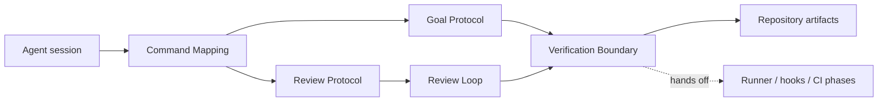

# Workflow command mapping — Phase 1 architecture

## Goal

Provide a project-local, discoverable command mapping for milestone kickoff and
adversarial review while preserving the repository's existing phase gates and
no-hard-timeout worker policy.

## Non-goals

- Do not implement the workflow checker, Git hooks, or CI in this phase.
- Do not register global pi commands or mutate a user's home configuration.
- Do not change application source, tests, or user-owned markdown behavior.
- Do not make skill text pretend to enforce a check that belongs to a later
  executable gate.

## Logical modules and contracts

### Command Mapping

**Input:** a historical workflow label or a real `/skill:<name>` command.
**Output:** a resolved skill name, or a typed `missing-mapping` failure naming
the expected project-local path. The current workflow owner repairs the mapping;
there is no silent fallback.

### Goal Protocol

**Input:** `GoalRequest { milestone, resume?, repositoryState }`.
**Output:** `GoalTransition { preflight, ledger, nextGate }` or
`GoalBlocked { kind, missingPaths, owner }`.
It owns preflight, durable phase-ledger resumption, phase ordering, worktree
ownership, and recovery after compaction or worker failure.

### Review Protocol

**Input:** `ReviewRequest { diff, specRefs, writer, round }`.
**Output:** `ReviewResult { status, findings, evidence, changedFiles }`, where
status is `clean`, `findings`, or `blocked`. A finding carries
`{ id, class, severity, location, evidence, disposition }`.
It owns one adversarial review pass and never turns a failed worker into a pass.

### Review Loop

**Input:** `ReviewLoopRequest { ownedDiff, specRefs, max? }`.
**Output:** `ReviewLoopResult { status, rounds, findingClasses, evidence }`.
It owns the round counter, finding-class history, clean stopping condition, and
restructure action after two consecutive rounds of the same class.

### Verification Boundary

**Input:** `VerificationRequest { requiredPaths, expectedCommands }`.
**Output:** `VerificationResult { ok, missingPaths, observations }`.
It performs only read-only mapping checks in this phase. Later phases own
stronger mechanical enforcement.

## Dependency diagram

## Edge annotation table

| From | To | Payload | Sync/Async | Failure owner | Retry policy |
|---|---|---|---|---|---|
| Agent session | Command Mapping | workflow label or real skill command | sync | current workflow owner | no retry; report `missing-mapping` |
| Command Mapping | Goal Protocol | resolved `GoalRequest` | sync | goal protocol | repair mapping, then retry from preflight |
| Command Mapping | Review Protocol | resolved `ReviewRequest` | sync | review protocol | repair mapping, then retry the pass |
| Review Protocol | Review Loop | `ReviewResult` with typed findings/evidence | sync | review-loop operator | repeat; do not hide `blocked` |
| Goal Protocol | Verification Boundary | `VerificationRequest` with paths/state | sync | goal operator | stop and repair missing state |
| Review Loop | Verification Boundary | clean-diff and evidence observations | sync | review-loop operator | rerun the check; no implicit pass |
| Verification Boundary | Repository artifacts | read-only filesystem/status observations | sync | current workflow operator | none; failure blocks next gate |
| Verification Boundary | Later phases | explicit pending-gate handoff | sync | next phase owner | later phase defines its own retries |

## State ownership

- **Command mapping:** owned by versioned project skill files and the workflow
  section of `AGENTS.md`; immutable during a run. The current workflow owner
  repairs a missing mapping before retrying.
- **Phase position:** owned by the active milestone ledger; the chat transcript
  is not authoritative.
- **Working changes:** owned by exactly one writer in one worktree; reviewers do
  not mutate that worktree.
- **Review findings/evidence:** owned by the review-loop operator and written to
  the review artifact required by the later runner phase.
- **Round history:** owned by the loop operator; finding classes are retained
  across rounds so repeated root causes trigger restructuring.
- **Worker liveness:** owned by the parent workflow through watchdog attention,
  checkpoints, and explicit handoff; no hard timeout is an implicit state
  transition.

## Failure boundaries

A missing skill file, stale phase ledger, shared writer, or failed worker stops
the protocol before production mutation. A successful mapping check proves only
that the command instructions are present; it does not prove tests, review,
verification, sealing, or deployment.

## Open questions deferred

- How the later executable checker represents phase state and emits failures.
- Which fast checks belong in pre-commit versus pre-push versus CI.
- How a review artifact is named and how CI verifies it.

## Self-Review

- **Regeneration check:** the first generic module split was materially weaker;
  explicit request/result contracts and typed blocked states now make ownership
  and recovery visible without inventing implementation details.
- **Edge check:** every diagram arrow has an owner, payload, sync mode, and
  retry policy; missing mapping and worker failure both stop before mutation.
- **State check:** phase state, finding classes, and review evidence are not
  hidden in chat or in a worker's temporary directory.
- **Simplification check:** the verification boundary is intentionally
  read-only; executable checks, hooks, and CI are not duplicated here.
