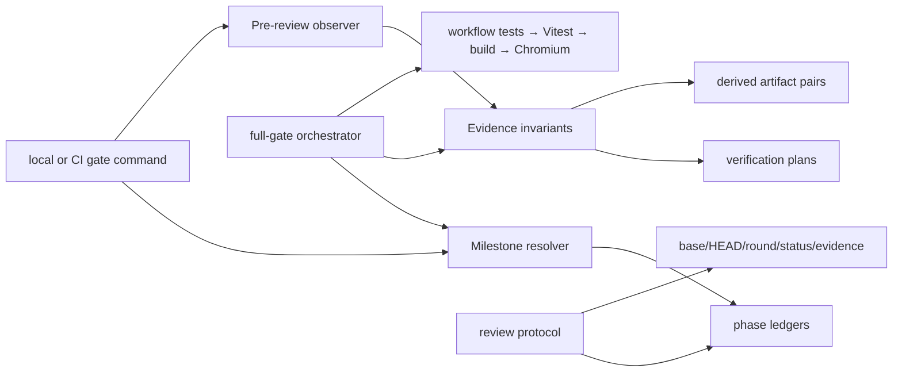

# Workflow evidence gates — architecture

## Goal and non-goals

- Select the actual milestone ledger instead of a historical CI default.
- Catch cheap verification-plan and derived-artifact drift before review.
- Give a reviewer an exact, read-only base-to-HEAD handoff.
- Preserve the existing full quality sequence and fail-closed worker rules.
- Do not change application behavior, Markdown bytes, or GitHub settings.

## Logical modules

- **Milestone resolver** — identifies the one open ledger or final closed
  target, and rejects ambiguity.
- **Evidence invariants** — checks verification-plan recursion and byte identity
  of committed derived artifacts.
- **Pre-review observer** — validates an exact commit range and spec, then emits
  review handoff evidence without mutating the checkout.
- **Full-gate orchestrator** — runs the resolver and invariants before the
  existing workflow, unit, build, and browser commands.
- **Review protocol** — records round evidence and defines blocked/failed worker
  handling, targeted feedback loops, and final-suite timing.

## Diagram

## Edge annotations

| From | To | Payload | Sync/Async | Failure owner | Retry policy |
|---|---|---|---|---|---|
| CLI | Milestone resolver | optional milestone path | sync | gate command | fail closed; explicit path may retry |
| Milestone resolver | phase ledgers | ledger text + numeric filename | sync | resolver | fail closed on ambiguity/unreadable state |
| CLI | Pre-review observer | base SHA + FEAT id | sync | gate command | caller supplies a corrected exact base |
| Pre-review observer | Evidence invariants | repository root | sync | invariant checker | fix source drift, then rerun |
| Evidence invariants | verification plans | plan text | sync | plan owner | edit plan before review |
| Evidence invariants | derived artifact pairs | source/generated bytes | sync | artifact owner | regenerate intentionally, then rerun |
| Full-gate orchestrator | Existing gates | resolved milestone + invariant result | sync | orchestrator | stops at first failure |
| Review protocol | phase ledger | round record | sync | phase owner/reviewer | append next round; blocked is never clean |

## State ownership

- The repository owns phase ledger, plan, source, and generated-artifact bytes.
- The resolver owns no persistent state; it derives a target from the current
  checkout.
- The pre-review observer owns only its returned evidence object and writes
  nothing.
- The phase owner writes the review ledger as ordinary Markdown after a round;
  subagent runtime artifacts are not authoritative.

## Contracts

- Milestone discovery returns one relative path or a structured blocking error.
- Plan checking returns zero or more `{ plan, spec, message }` violations.
- Artifact checking returns zero or more `{ source, generated }` mismatches.
- Pre-review returns base SHA, current HEAD, changed paths, spec/status output,
  and invariant observations; it must not run the full E2E command.
- Full-gate planning retains the existing command order after the two new cheap
  checks.

## Self-review

A fresh read found no state that needs a new persistence layer: all decisions
are derived or written to the existing milestone ledger. The resolver is kept
separate from invariant checks because milestone ambiguity and source drift
have different owners. The pre-review observer does not proxy application test
selection; that remains phase-specific and avoids guessing a test command.
The main simplification is keeping both cheap checks in the existing gate
orchestrator rather than adding a new daemon or CI job.
