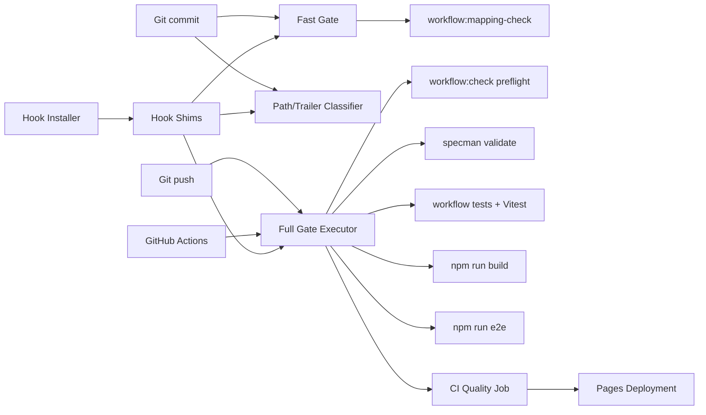

# Workflow gate enforcement — Phase 1 architecture

## Goal

Provide one checked-in gate executor for fast commit checks, commit-message
traceability, full pre-push/CI validation, opt-in hooks, and deploy prerequisites.

## Non-goals

- Do not change product code, UI, extension behavior, or markdown bytes.
- Do not make hooks mandatory through global configuration or postinstall.
- Do not kill, retry, or steer substantive workers.
- Do not duplicate the full command sequence in multiple shell/YAML bodies.

## Logical modules and contracts

### Path/Trailer Classifier

**Input:** staged path list and commit message text.
**Output:** `CommitGateResult { requiresTrailer, hasTrailer, errors }`.
It classifies behavioral/workflow paths and validates the stable spec trailer.

### Fast Gate

**Input:** cached Git diff and mapping check result.
**Output:** `FastGateResult { ok, command, output }`.
It performs only read-only, quick checks suitable for pre-commit.

### Full Gate Executor

**Input:** `FullGateRequest { root, milestonePath, mode, runner }`.
**Output:** `FullGateResult { ok, completed, failed, evidence }`.
It runs the fixed command list in order and stops on the first failure.

### Hook Shims/Installer

**Input:** Git hook invocation and repository root.
**Output:** delegated gate exit status; installer updates only local
`core.hooksPath`.

### CI/Deploy Workflow

**Input:** pull request or main push.
**Output:** quality job status consumed as a deployment prerequisite.
It installs dependencies and invokes the same checked-in full gate.

## Dependency diagram

## Edge annotation table

| From | To | Payload | Sync/Async | Failure owner | Retry policy |
|---|---|---|---|---|---|
| Git commit | Fast Gate | cached diff | sync | gate executor | no retry; block commit |
| Git commit | Path/Trailer Classifier | staged paths + message | sync | classifier | no retry; fix message/staging |
| Git push | Full Gate Executor | milestone path + repo root | sync | gate executor | manual rerun after repair |
| CI | Full Gate Executor | clean checkout + milestone path | sync | CI job | provider rerun is explicit, not gate retry |
| Fast Gate | Mapping check | checked-in script path | sync | fast gate | no retry |
| Full Gate | Workflow commands | ordered command descriptors | sync | full executor | stop on first nonzero |
| Hook Installer | Hook Shims | local hooks path | sync | installer | rerun idempotently |
| Quality Job | Pages Deployment | successful job status | sync | deploy workflow | no deploy when quality fails |

## State ownership

- **Staged paths/message:** Git owns them; gates only observe.
- **Command sequence/evidence:** gate executor owns in-memory results until exit;
  no hidden evidence file is created.
- **Hook configuration:** Git's repository-local config owns it; installer does
  not touch global config.
- **Quality/deploy status:** GitHub Actions owns job dependency state.
- **Worker liveness:** parent workflow/agent owns it through skills and
  checkpoints; this gate layer does not manage subagents.

## Failure boundaries

A whitespace error blocks pre-commit. A missing trailer blocks behavioral
commits. A failed full command blocks later commands and deployment. An
uninstalled hook does not weaken CI. A CI quality failure prevents the Pages
build/deploy job from proceeding.

## Open questions deferred

- Whether a future full gate should emit JSON evidence for external tooling.
- How to support non-POSIX developers without weakening the repository CI gate.
- Whether deployment should be split into a reusable workflow once the project
  has more than one deploy target.

## Self-Review

- **Regeneration check:** separate gate implementations were rejected in favor
  of one executor with thin adapters; this removes the largest drift risk.
- **Edge check:** every arrow has a payload, sync mode, failure owner, and retry
  policy; local bypass has an explicit CI path around it.
- **State check:** hooks and CI do not persist hidden state or alter markdown.
- **Simplification check:** no JSON artifact, branch policy, or global setup is
  introduced before demand requires it.
