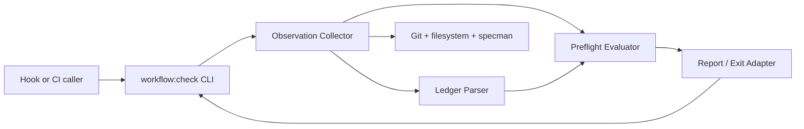

# Workflow preflight checker — Phase 1 architecture

## Goal

Validate repository ownership, project-local command mapping, specman
availability, required documents, and a durable milestone ledger before a phase
may mutate production files.

## Non-goals

- Do not repair a ledger, clean a worktree, create missing files, or infer state.
- Do not run tests, build, E2E, review, verify, seal, hooks, or CI here.
- Do not change application source or user-owned markdown.
- Do not impose a hard wall-clock timeout on substantive repository commands.

## Logical modules and contracts

### Observation Collector

**Input:** `PreflightRequest { root, milestonePath }`.
**Output:** `PreflightObservation { paths, agentsTracked, mapping, specman,
worktree, ledger }`.
It performs read-only filesystem and child-command observations.

### Ledger Parser

**Input:** milestone markdown text.
**Output:** `LedgerState { currentPhase, lastCompletedGate, nextAction }` or
field-specific `ledger-missing-*` errors.

### Preflight Evaluator

**Input:** `PreflightObservation`.
**Output:** `PreflightResult { ok, milestonePath, ledger, checks, errors }`.
It is pure, aggregates every failure, and owns stable error codes.

### Report/Exit Adapter

**Input:** `PreflightResult`.
**Output:** human-readable stdout/stderr and process exit status.
It never writes files and maps `ok` to exit 0, errors to exit 1.

## Dependency diagram

## Edge annotation table

| From | To | Payload | Sync/Async | Failure owner | Retry policy |
|---|---|---|---|---|---|
| Hook/CI caller | CLI | `preflight --milestone <path>` | sync | caller | rerun after explicit repair |
| CLI | Observation Collector | `PreflightRequest` | sync | CLI | no automatic retry |
| Observation Collector | Git/filesystem/specman | read-only commands/text | sync | collector | report launch/nonzero failure |
| Observation Collector | Ledger Parser | milestone markdown | sync | parser | none; report missing fields |
| Ledger Parser | Preflight Evaluator | `LedgerState` or field errors | sync | evaluator | none; block transition |
| Collector | Preflight Evaluator | `PreflightObservation` | sync | evaluator | none; aggregate all failures |
| Evaluator | Report/Exit Adapter | `PreflightResult` | sync | report adapter | none; exit nonzero on errors |
| Report/Exit Adapter | CLI caller | stdout/stderr + status | sync | caller | repair then rerun |

## State ownership

- **Repository state:** owned by Git, filesystem, and specman; the checker only
  observes it.
- **Ledger state:** owned by the milestone markdown; the parser returns a value
  but never writes it.
- **Evaluation result:** owned by the current process until it exits; no result
  is persisted as a hidden side effect.
- **Repair/recovery:** owned by the parent workflow/operator, not the checker.

## Failure boundaries

- Missing required path → `missing-path` with the exact relative path.
- Absolute or symlinked milestone outside root → `milestone-outside-root`.
- Existing but unreadable milestone → `milestone-unreadable`.
- Missing CLI operand → usage output and exit 2.
- Untracked `AGENTS.md` → `agents-untracked`.
- Dirty/untracked worktree → `dirty-worktree`.
- Missing ledger label → `ledger-missing-current-phase`,
  `ledger-missing-last-completed-gate`, or `ledger-missing-next-action`.
- Specman launch/nonzero failure → `specman-unavailable` with command output.
- Any preflight error causes exit 1; CLI syntax errors cause exit 2; no partial
  success is reported.

## Open questions deferred

- Whether a future `phase` command should validate spec sync/seal state or leave
  that to specman directly.
- Which exact preflight subset is fast enough for pre-commit versus CI.
- Whether a JSON report is needed for CI; text output is sufficient for P1.

## Self-Review

- **Regeneration check:** a single CLI-with-inline-checks design was rejected;
  separating collection, parsing, pure evaluation, and reporting makes all
  failure classes testable and keeps file writes impossible by construction.
- **Edge check:** every arrow has an owner, payload, sync mode, and retry policy;
  all repair decisions leave the checker.
- **State check:** no phase state is persisted by the checker and no shell output
  is treated as spec truth after a failed command.
- **Simplification check:** one command and one text report are enough for P1;
  JSON, hooks, CI, and multiple modes are deferred.
